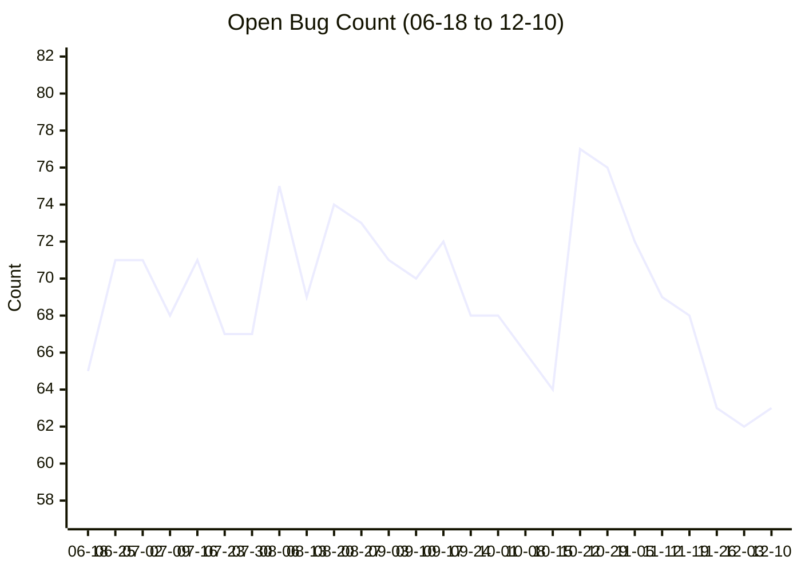
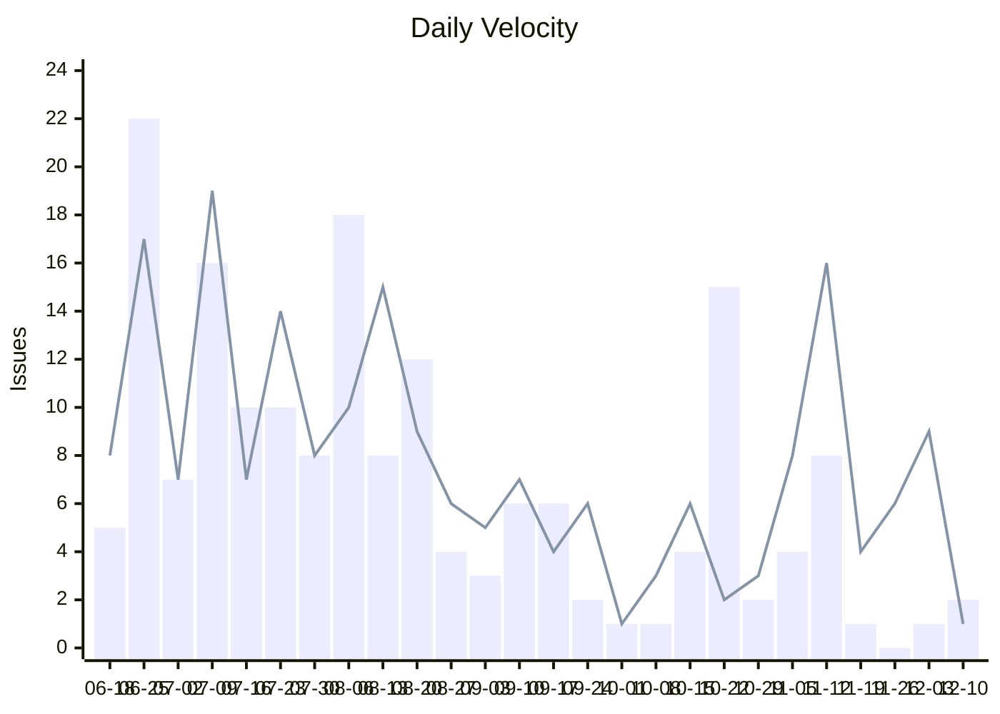
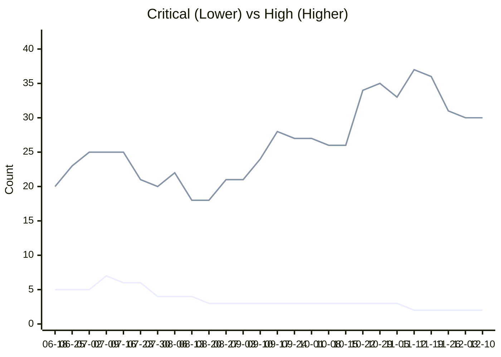
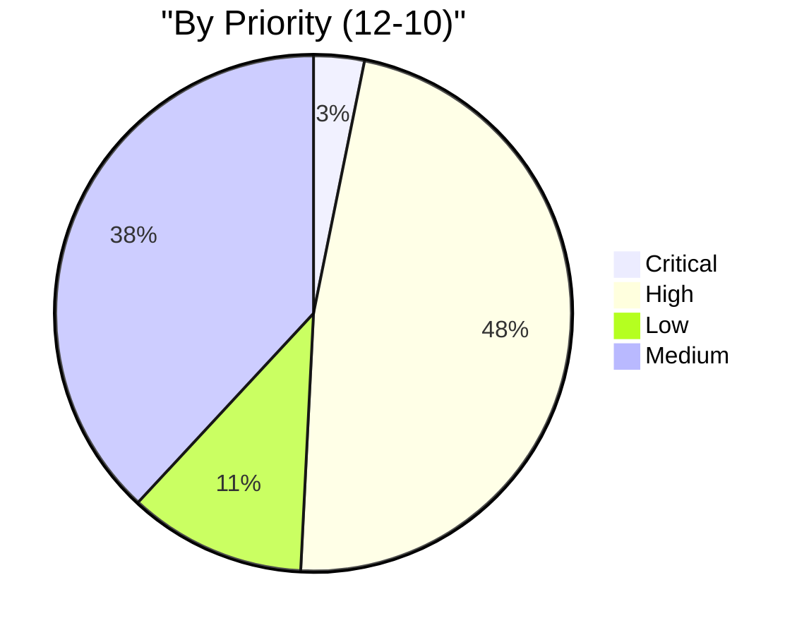
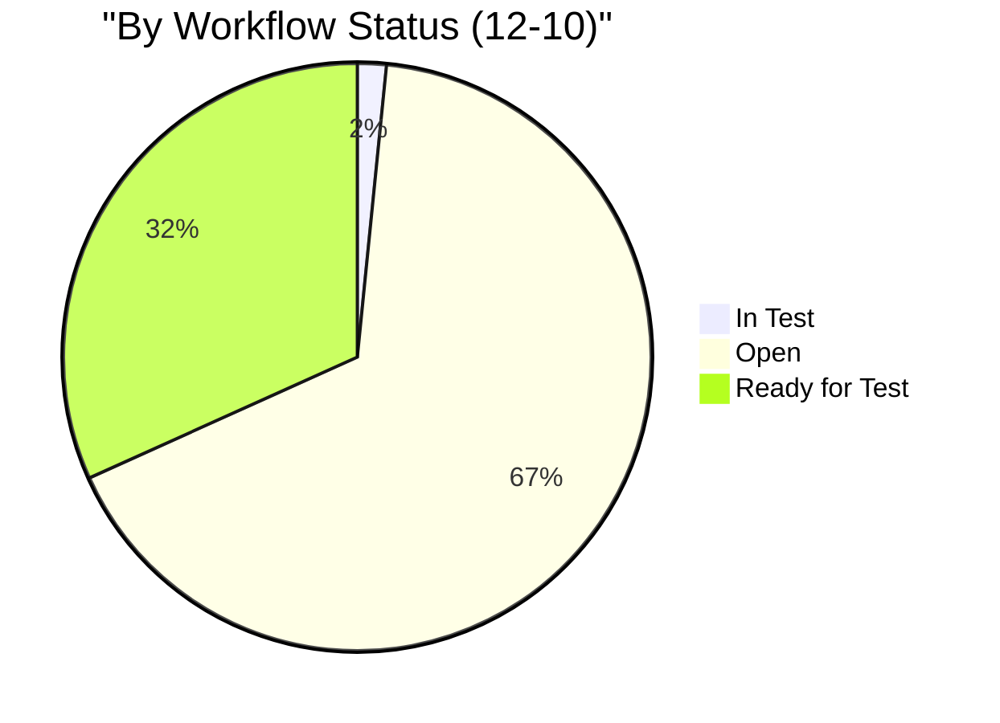

# Bug Stability Charts (12-10)

## 1. Open Bug Trend (Backlog)
Shows the total number of unresolved bugs over time. Lower is better.



## 2. New vs Fixed (Velocity)
Compares incoming bugs (New) vs resolved bugs (Fixed). Fixed > New is ideal.



## 3. Critical vs High Trend
Splitting top priorities. **Line 1 (Lower)** = Critical, **Line 2 (Higher)** = High.



## 4. Convergence Forecast
> 🟢 **Prediction:** At current velocity (-4.1/day), backlog will clear in ~15 days.

```mermaid
xychart-beta
    title "Burndown Forecast"
    x-axis ["12-10", "+1W", "+2W", "+3W"]
    y-axis "Open Bugs" 0 --> 73
    line [63, 34, 4, 0]
```

## 5. Breakdown by Priority


| Priority | Count |
|---|---|
| Critical | 2 |
| High | 30 |
| Low | 7 |
| Medium | 24 |

## 6. Breakdown by Status
State of active bugs in the workflow.



| Status | Count |
|---|---|
| In Test | 1 |
| Open | 42 |
| Ready for Test | 20 |

